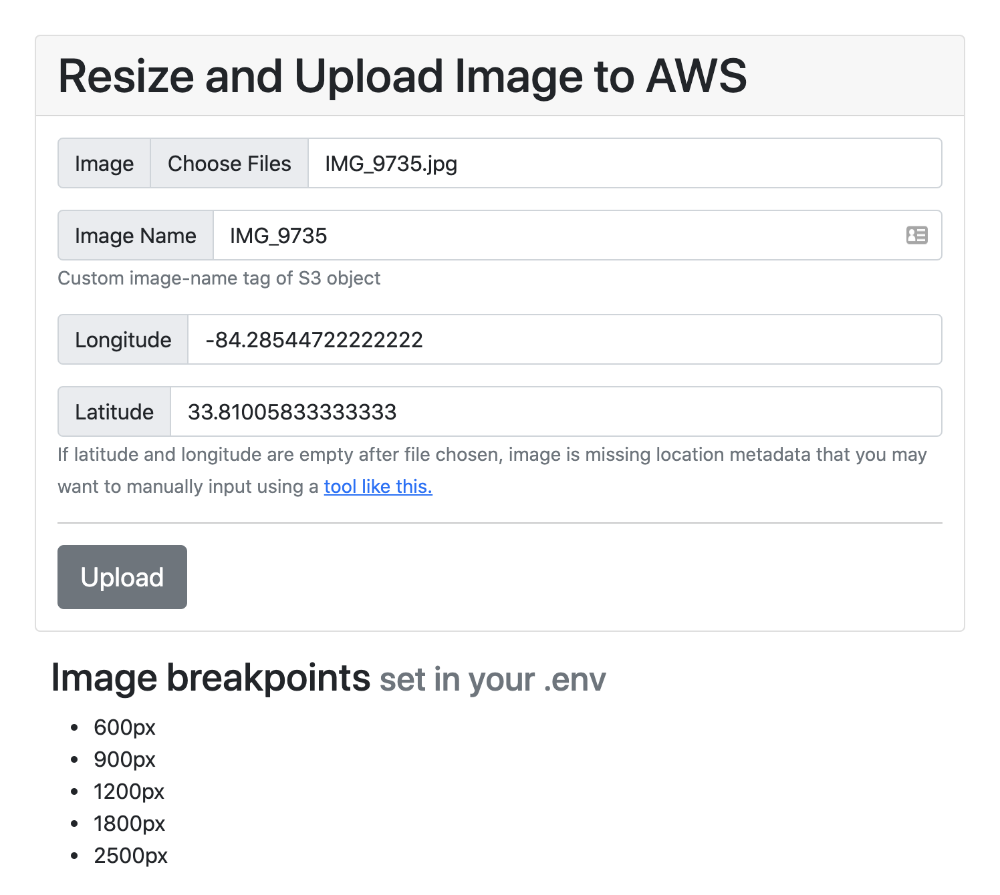
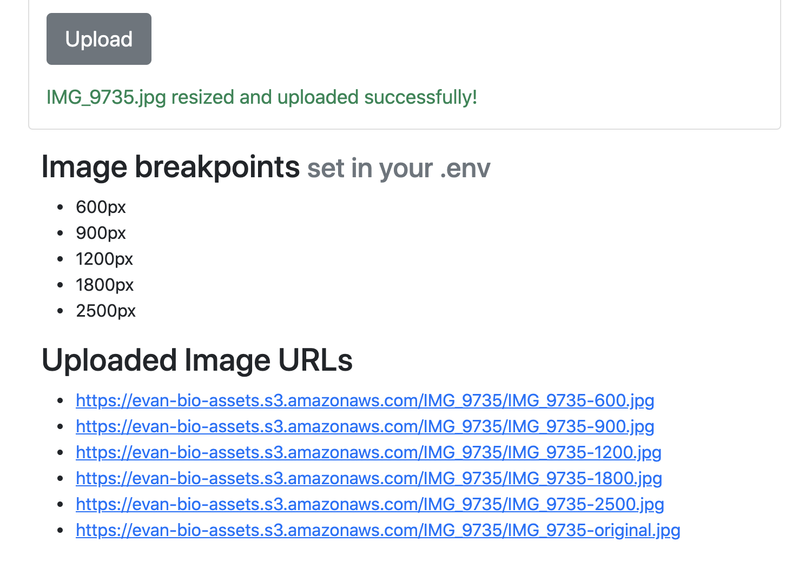
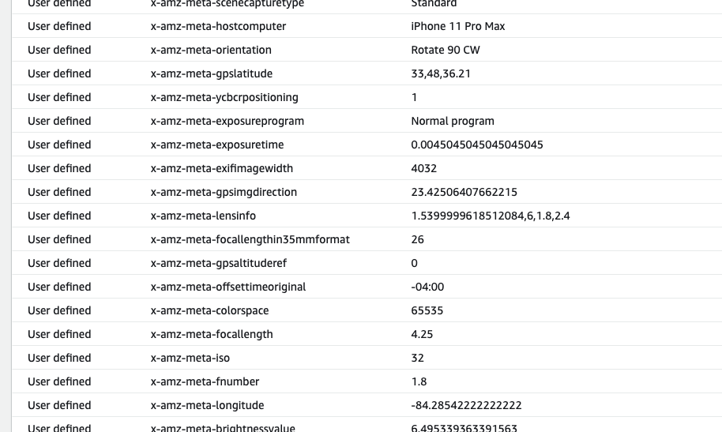

# Resize and Upload Image to AWS S3

Web app intended to run locally used for resizing an image into responsive sizes set in `.env` and uploading them to an S3 bucket. 

Image EXIF metadata like GPS location, shutter speed, ISO, etc are included in the S3 upload as custom metadata tags.

Useful for personal portfolio, photography, or other media sites where you adjust your assets locally, like a Jekyl blog or static portfolio site. This tool makes it easy to upload responsive images that can leverage [srcset](https://developer.mozilla.org/en-US/docs/Learn/HTML/Multimedia_and_embedding/Responsive_images#resolution_switching_different_sizes) to improve your page load times and SEO.

You could add auth and run a modified version of this on a live server to provide a rudimentary photo-upload CMS.

## Example

### Image selected and lat/long data automatically extracted

### URLs of resized image after successful upload

### Metadata in AWS

## Usage

Prereqs:
- Node.js v14+

Steps:

1. Clone this repository and navigate to it
1. Copy `.env.example` to `.env`. Fill out the following
    - `BUCKET_NAME`: S3 bucket where you want images stored
    - `AWS_ID`: IAM user ID with S3 bucket write permissions
    - `AWS_SECRET`: IAM user secret
1. `npm install`
1. `npm start`

Images are saved in `BUCKET_NAME`, one for each dimmension specified in `IMAGE_BREAKPOINTS`.

They are saved in the form `image_name/image_name-${dimmension}.jpg`. e.g. `IMG_123/IMG_123-600.jpg`

The original (not resized) image is saved as `image_name/image_name-original.jpg`. e.g. `IMG_123/IMG_123-original.jpg`

If you'd like to change this pattern, adjust line 88 of [server.js](https://github.com/Ebonsignori/image-resize-upload-aws/blob/main/server.js#L88)
